# Atar Entity Relationships Reference

> Auto-generated from API response schema analysis

Generated: 2026-04-12

---

## Overview

The Atar property management platform uses a **multi-tenant relational model** with:
- 4 core entity domains (Properties, Contacts, Leasing, Requests)
- 12+ primary entities with embedded relationships
- Hierarchical property structure (Community → Building → Unit)
- Polymorphic contact types (Owner, Tenant, Admin, Professional)

---

## Entity Relationship Diagram (Mermaid)

```mermaid
erDiagram
    %% Properties Domain
    COMMUNITY ||--o{ BUILDING : contains
    COMMUNITY }|--|| COUNTRY : located_in
    COMMUNITY }|--|| CURRENCY : uses
    COMMUNITY }|--|| CITY : located_in
    COMMUNITY }|--|| DISTRICT : located_in
    COMMUNITY ||--o{ AMENITY : has
    COMMUNITY ||--o{ FACILITY : has

    BUILDING ||--o{ UNIT : contains
    BUILDING }|--|| COMMUNITY : belongs_to
    BUILDING }|--|| CITY : located_in
    BUILDING }|--|| DISTRICT : located_in

    UNIT }|--|| BUILDING : belongs_to
    UNIT }|--|| COMMUNITY : belongs_to
    UNIT }|--|| UNIT_CATEGORY : categorized_as
    UNIT }|--|| UNIT_TYPE : typed_as
    UNIT }|--|| STATUS : has_status

    %% Contacts Domain
    OWNER ||--o{ UNIT : owns
    OWNER ||--o{ TRANSACTION : assigned
    OWNER ||--o{ REQUEST : creates

    TENANT ||--o{ UNIT : occupies
    TENANT ||--o{ LEASE : party_to
    TENANT ||--o{ TRANSACTION : assigned
    TENANT ||--o{ REQUEST : creates
    TENANT ||--o{ DOCUMENT : uploads

    ADMIN }|--|| MANAGER_ROLE : has_role
    ADMIN ||--o{ COMMUNITY : scoped_to
    ADMIN ||--o{ BUILDING : scoped_to

    PROFESSIONAL ||--o{ SERVICE_TYPE : assigned_to
    PROFESSIONAL ||--o{ REQUEST : handles

    %% Leasing Domain
    LEASE }|--|| TENANT : tenant
    LEASE ||--o{ UNIT : covers
    LEASE }|--|| STATUS : has_status
    LEASE ||--o{ TRANSACTION : generates

    SUB_LEASE }|--|| LEASE : extends

    %% Transactions Domain
    TRANSACTION }|--|| CATEGORY : categorized_as
    TRANSACTION }|--|| SUBCATEGORY : subcategorized_as
    TRANSACTION }|--|| STATUS : has_status
    TRANSACTION }|--|| TYPE : typed_as
    TRANSACTION ||--o{ PAYMENT : receives

    %% Requests Domain
    REQUEST }|--|| REQUEST_CATEGORY : categorized_as
    REQUEST }|--|| REQUEST_SUBCATEGORY : subcategorized_as
    REQUEST }|--|| STATUS : has_status
    REQUEST }|--|| UNIT : for_unit
    REQUEST }|--|| PROFESSIONAL : assigned_to

    REQUEST_CATEGORY ||--o{ REQUEST_SUBCATEGORY : has
    REQUEST_CATEGORY ||--|| SERVICE_SETTINGS : configured_by

    FACILITY_BOOKING }|--|| FACILITY : for_facility
    FACILITY_BOOKING }|--|| TENANT : booked_by
    FACILITY_BOOKING }|--|| STATUS : has_status

    %% Marketplace Domain
    MARKETPLACE_UNIT }|--|| UNIT : references
    MARKETPLACE_UNIT }|--|| STATUS : has_status

    MARKETPLACE_VISIT }|--|| MARKETPLACE_UNIT : for_unit
    MARKETPLACE_VISIT }|--|| STATUS : has_status
```



---

## Core Entities

### 1. Properties Domain

#### Community
Top-level property grouping (residential compound, development, etc.)

| Field | Type | Relationship | FK Table |
|-------|------|--------------|----------|
| id | number | PK | - |
| country | object | N:1 | countries |
| currency | object | N:1 | currencies |
| city | object | N:1 | cities |
| district | object | N:1 | districts |
| amenities | array | 1:N | community_amenities |
| images | array | 1:N | media |
| documents | array | 1:N | media |

**Derived Fields:**
- `buildings_count` - Count of child buildings
- `units_count` - Count of units across all buildings
- `requests_count` - Count of related service requests
- `total_income` - Sum of transaction amounts

**API Endpoints:**
- `GET rf/communities` - List all
- `GET rf/communities/{id}` - Get detail
- `POST rf/communities` - Create
- `PUT rf/communities/{id}` - Update

---

#### Building
Physical structure within a community

| Field | Type | Relationship | FK Table |
|-------|------|--------------|----------|
| id | number | PK | - |
| community | object | N:1 | rf_communities |
| city | object | N:1 | cities |
| district | object | N:1 | districts |
| images | array | 1:N | media |
| documents | array | 1:N | media |

**API Endpoints:**
- `GET rf/buildings` - List all
- `GET rf/buildings/{id}` - Get detail
- `POST rf/buildings/store` - Create
- `PUT rf/buildings/{id}` - Update

---

#### Unit
Individual rentable/sellable property

| Field | Type | Relationship | FK Table |
|-------|------|--------------|----------|
| id | number | PK | - |
| rf_community | object | N:1 | rf_communities |
| rf_building | object | N:1 | rf_buildings |
| category | object | N:1 | rf_unit_categories |
| type | object | N:1 | rf_unit_types |
| status | object | N:1 | rf_statuses |
| city | object | N:1 | cities |
| district | object | N:1 | districts |
| images | array | 1:N | media |
| documents | array | 1:N | media |

**Status Values:**
- `1` = Vacant (شاغرة)
- `2` = Occupied (مشغولة)
- `3` = Under Maintenance (تحت الصيانة)
- `4` = Reserved (محجوزة)

**API Endpoints:**
- `GET rf/units` - List all
- `GET rf/units/{id}` - Get detail
- `POST rf/units` - Create
- `PUT rf/units/{id}` - Update

---

#### Facility
Shared amenity that can be booked (gym, pool, meeting room)

| Field | Type | Relationship | FK Table |
|-------|------|--------------|----------|
| id | number | PK | - |
| community | object | N:1 | rf_communities |
| category | object | N:1 | rf_facility_categories |
| images | array | 1:N | media |

**API Endpoints:**
- `GET rf/facilities` - List all
- `POST rf/facilities/store` - Create

---

### 2. Contacts Domain

#### Owner
Property owner who owns units

| Field | Type | Relationship | FK Table |
|-------|------|--------------|----------|
| id | number | PK | - |
| units | array | 1:N | rf_units |
| transaction | array | 1:N | rf_transactions |
| active_requests | array | 1:N | rf_requests |
| nationality | object | N:1 | countries |

**API Endpoints:**
- `GET rf/owners` - List all
- `GET rf/owners/{id}` - Get detail
- `POST rf/owners` - Create
- `PUT rf/owners/{id}` - Update

---

#### Tenant
Person renting/occupying a unit

| Field | Type | Relationship | FK Table |
|-------|------|--------------|----------|
| id | number | PK | - |
| units | array | 1:N | rf_units |
| leases | array | 1:N | rf_leases |
| transaction | array | 1:N | rf_transactions |
| active_requests | array | 1:N | rf_requests |
| documents | array | 1:N | media |
| nationality | object | N:1 | countries |
| source | object | N:1 | rf_lead_sources |

**Special Fields:**
- `invited` - Boolean, tenant was invited via app
- `accepted_invite` - Boolean, tenant accepted invitation

**API Endpoints:**
- `GET rf/tenants` - List all
- `GET rf/tenants/{id}` - Get detail
- `POST rf/tenants` - Create
- `PUT rf/tenants/{id}` - Update
- `POST rf/tenants/{id}/send-invitation` - Send app invitation

---

#### Admin
Platform administrative user with role-based access

| Field | Type | Relationship | FK Table |
|-------|------|--------------|----------|
| id | number | PK | - |
| role | number | N:1 | rf_manager_roles |
| selects.communities | array | N:N | rf_communities |
| selects.buildings | array | N:N | rf_buildings |

**Manager Roles:**
| ID | Role |
|----|------|
| 1 | Admin (full access) |
| 2 | Accounting Manager |
| 3 | Service Manager |
| 4 | Marketing Manager |
| 5 | Sales & Leasing Manager |

**Scope Access:**
- `is_all_communities: true` → Access all communities
- `is_all_buildings: true` → Access all buildings
- Otherwise scoped to specific `communities[]` or `buildings[]`

**API Endpoints:**
- `GET rf/admins` - List all
- `GET rf/admins/{id}` - Get detail
- `POST rf/admins` - Create
- `PUT rf/admins/{id}` - Update
- `GET rf/admins/manager-roles` - List roles

---

#### Professional
Service provider assigned to handle requests

| Field | Type | Relationship | FK Table |
|-------|------|--------------|----------|
| id | number | PK | - |
| service_types | array | N:N | rf_service_manager_types |

**Service Manager Types:**
| ID | Type |
|----|------|
| 1 | Home Service Requests |
| 2 | Common Area Requests |
| 3 | Visitor Access Requests |
| 5 | Facility Booking Requests |

**API Endpoints:**
- `GET rf/professionals` - List all
- `POST rf/professionals` - Create

---

### 3. Leasing Domain

#### Lease
Rental agreement between landlord and tenant

| Field | Type | Relationship | FK Table |
|-------|------|--------------|----------|
| id | number | PK | - |
| tenant | object | N:1 | rf_tenants |
| units | array | N:N | rf_units |
| status | object | N:1 | rf_statuses |
| transactions | array | 1:N | rf_transactions |

**Status Lifecycle:**
| ID | Status | Transition From |
|----|--------|-----------------|
| 30 | Draft | Initial |
| 34 | Active | Draft, Renewed |
| 31 | Expired | Active |
| 33 | Terminated | Active |
| 32 | Cancelled | Draft |

**Key Fields:**
- `lease_number` - Unique reference (e.g., "2026000001RL")
- `start_date` / `end_date` - Lease period
- `contract_value` - Total contract amount
- `installments` - Payment schedule

**API Endpoints:**
- `GET rf/leases` - List all
- `GET rf/leases/{id}` - Get detail
- `POST rf/leases/create` - Create
- `PUT rf/leases/{id}` - Update
- `POST rf/leases/{id}/activate` - Activate draft
- `POST rf/leases/{id}/terminate` - Terminate active

---

#### Sub-Lease
Extension of an existing lease

| Field | Type | Relationship | FK Table |
|-------|------|--------------|----------|
| id | number | PK | - |
| lease | object | N:1 | rf_leases |

**API Endpoints:**
- `GET rf/sub-leases` - List all

---

### 4. Transactions Domain

#### Transaction
Financial record (invoice, payment due, etc.)

| Field | Type | Relationship | FK Table |
|-------|------|--------------|----------|
| id | number | PK | - |
| category | object | N:1 | transaction_categories |
| subcategory | object | N:1 | transaction_subcategories |
| type | object | N:1 | transaction_types |
| status | object | N:1 | rf_statuses |
| assignee_id | number | N:1 | rf_tenants / rf_owners |
| unit | object | N:1 | rf_units |
| payments | array | 1:N | rf_payments |

**Transaction Categories:**
| ID | Category |
|----|----------|
| 1 | Rentals (الإيجارات) |
| 19 | Insurance Refund (استرجاع التأمين) |

**Status Types:**
| ID | Status |
|----|--------|
| 1 | Paid (مدفوع) |
| 2 | Due (مستحقة) |

**API Endpoints:**
- `GET rf/transactions` - List all
- `POST rf/transactions` - Create
- `PUT rf/transactions/{id}` - Update

---

### 5. Requests Domain

#### Request Category
Top-level service request classification

| Field | Type | Relationship | FK Table |
|-------|------|--------------|----------|
| id | number | PK | - |
| sub_categories | array | 1:N | rf_request_subcategories |
| serviceSettings | object | 1:1 | Embedded config |
| icon | object | N:1 | media |

**Categories:**
| ID | Category | Has Sub-Categories |
|----|----------|-------------------|
| 1 | Unit Services (خدمات الوحدات) | Yes |
| 2 | Common Area Requests (طلبات المناطق المشتركة) | Yes |
| 3 | Visitor Access Requests (طلبات تصاريح الزوار) | No |
| 4 | Manager Requests (طلبات المدير) | No |
| 5 | Facility Bookings (حجوزات المرافق) | No |

**Service Settings Structure:**
```json
{
  "visibilities": {
    "hide_resident_number": boolean,
    "hide_resident_name": boolean,
    "hide_professional_number_and_name": boolean,
    "show_unified_number_only": boolean
  },
  "permissions": {
    "manager_close_Request": boolean,
    "not_require_professional_enter_request_code": boolean,
    "not_require_professional_upload_request_photo": boolean,
    "attachments_required": boolean,
    "allow_professional_reschedule": boolean
  }
}
```

---

#### Request Sub-Category
Specific service type under a category

| Field | Type | Relationship | FK Table |
|-------|------|--------------|----------|
| id | number | PK | - |
| category_id | number | N:1 | rf_request_categories |
| selects.buildings | array | N:N | rf_buildings |
| selects.communities | array | N:N | rf_communities |
| icon | object | N:1 | media |
| featured | array | 1:N | Highlighted items |

**Unit Service Sub-Categories (Category 1):**
| ID | Name |
|----|------|
| 1 | Maintenance (صيانة) |
| 2 | House Cleaning (تنظيف المنزل) |
| 3 | Car Wash (غسيل السيارات) |
| 4 | Electrical Appliances (الأجهزة الكهربائية) |
| 5 | Furniture Repair (إصلاح الأثاث) |
| 6 | Other Services (خدمات أخرى) |

**Common Area Sub-Categories (Category 2):**
| ID | Name |
|----|------|
| 7 | Security & Safety (الأمن و السلامة) |
| 8 | Unit Issues (مشاكل الوحدات) |
| 9 | Resident Issues (مشاكل السكان) |
| 10 | Service Issues (مشاكل الخدمات) |
| 11 | Other Issues (مشاكل اخرى) |

**API Endpoints:**
- `GET rf/requests/categories` - List categories
- `GET rf/requests/sub-categories` - List sub-categories
- `GET rf/requests/sub-categories/{id}` - Get detail

---

### 6. Reference/Lookup Tables

#### Country
| Field | Type | Example |
|-------|------|---------|
| id | number | 1 |
| name | string | المملكة العربية السعودية |
| code | string | SA |

#### Currency
| Field | Type | Example |
|-------|------|---------|
| id | number | 1 |
| name | string | ريال سعودي |
| code | string | SAR |

#### City
| Field | Type | Example |
|-------|------|---------|
| id | number | 1 |
| name | string | الرياض |

#### District
| Field | Type | Example |
|-------|------|---------|
| id | number | 1 |
| name | string | الدرعية |

#### Status
Universal status table used across entities

| ID Range | Domain | Example Statuses |
|----------|--------|-----------------|
| 1-10 | Service Requests | New, In Progress, Completed |
| 11-17 | Visitor Access | Pending, Approved, Denied |
| 19-22 | Facility Booking | Pending, Confirmed, Cancelled |
| 30-34 | Leases | Draft, Active, Expired |
| 35-38 | Facility Requests | Pending, Approved |
| 39-49 | Marketplace | Listed, Sold, Withdrawn |

---

## Relationship Cardinalities

| Parent | Child | Cardinality | FK Field |
|--------|-------|-------------|----------|
| Community | Building | 1:N | community_id |
| Building | Unit | 1:N | building_id |
| Community | Unit | 1:N | community_id (via Building) |
| Community | Facility | 1:N | community_id |
| Owner | Unit | 1:N | owner_id |
| Tenant | Lease | 1:N | tenant_id |
| Lease | Unit | N:N | lease_units (junction) |
| Lease | Transaction | 1:N | lease_id |
| Tenant | Transaction | 1:N | assignee_id |
| Owner | Transaction | 1:N | assignee_id |
| Category | SubCategory | 1:N | category_id |
| Request | Professional | N:1 | professional_id |
| Admin | Role | N:1 | role |
| Admin | Community | N:N | admin_communities |
| Admin | Building | N:N | admin_buildings |

---

## Embedded Objects vs Foreign Keys

The API uses **embedded objects** rather than raw foreign keys in responses:

```json
// Example: Building with embedded community
{
  "id": 4,
  "name": "Building A",
  "community": {
    "id": 1,
    "name": "Test Community",
    "city": { "id": 1, "name": "Riyadh" }
  }
}
```

**Benefits:**
- Single API call returns complete entity graph
- Reduces N+1 query patterns on client
- Enables offline-first mobile app support

**When creating/updating**, use foreign key IDs:
```json
// POST/PUT requests use IDs
{
  "name": "Building A",
  "community_id": 1,
  "city_id": 1
}
```

---

## Junction Tables (Inferred)

These junction tables are inferred from the API response structures:

| Junction Table | Entity 1 | Entity 2 |
|----------------|----------|----------|
| lease_units | rf_leases | rf_units |
| admin_communities | rf_admins | rf_communities |
| admin_buildings | rf_admins | rf_buildings |
| professional_service_types | rf_professionals | rf_service_types |
| community_amenities | rf_communities | rf_amenities |
| subcategory_communities | rf_subcategories | rf_communities |
| subcategory_buildings | rf_subcategories | rf_buildings |

---

## Entity Dependencies (Creation Order)

When seeding test data, create entities in this order:

1. **Reference Data** (static lookup tables)
   - Country → Currency → City → District
   - Unit Category → Unit Type
   - Status (all domains)
   - Request Categories → Sub-Categories

2. **Properties**
   - Community → Building → Unit → Facility

3. **Contacts**
   - Owner → Tenant → Admin → Professional

4. **Leasing**
   - Lease (requires Tenant + Units) → Sub-Lease

5. **Transactions**
   - Transaction (requires Lease or direct assignment)

6. **Requests**
   - Service Request (requires Tenant/Owner + Unit + Category)
   - Visitor Access (requires Tenant)
   - Facility Booking (requires Tenant + Facility)

---

## API Conventions

### List Endpoints
- Use pagination: `?page=1&per_page=10`
- Return `data[]` array with items
- Include `meta` for pagination info

### Detail Endpoints
- Return `data` object with full entity
- Include embedded relationships (not just IDs)
- Include `message` for success confirmation

### Create/Update Endpoints
- Accept foreign key IDs (not embedded objects)
- Return created/updated entity with embedded objects
- Return validation errors as field-level messages
